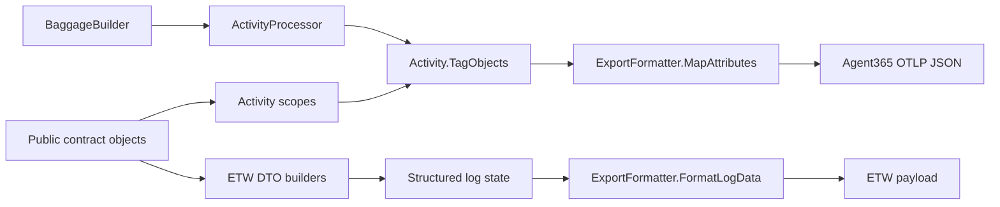

# A365 unused and non-exported code audit

## TL;DR

The A365 exporter serializes every `Activity.TagObjects` entry, so data reaches the exported span only when a scope, processor, or DTO builder first converts it into an attribute. Four public inputs were retained only in contract objects and never became exported attributes: `AgentDetails.AgentType`, `AgentDetails.AgentClientIP`, `InferenceCallDetails.ResponseId`, and `Request.OperationSource`. The ETW/logging invoke-agent path also dropped request session values that the Activity scope path preserved. Separately, there are several high-confidence dead internal artifacts: the Semantic Kernel `AiChoice` model graph, `OtlpStatus`, and the legacy OpenAI `WithOpenAI` builder path.

This audit proves repository-local usage only. Public APIs may have external NuGet consumers, so "unused" does not automatically mean "safe to remove."

## Resolution status

The contract and mapping findings requested for cleanup were implemented on branch `a365-contract-cleanup`:

| Finding | Resolution |
|---|---|
| `AgentDetails.AgentType` | Property, constructor/deconstructor values, equality/hash participation, tests, public API entries, and the orphaned `AgentType` enum were removed |
| `AgentDetails.AgentClientIP` | Property, constructor/deconstructor values, equality/hash participation, tests, and public API entries were removed |
| `InferenceCallDetails.ResponseId` | Property, constructor/deconstructor values, equality/hash participation, tests, and public API entries were removed |
| `Request.OperationSource` | Retained as `string?` and mapped to `service.name` by invoke-agent, inference, execute-tool, and output scopes; invoke-agent ETW DTO mapping was also added |
| `OperationSource` enum | Retained for external callers |
| `OutputScope` session ID | `Request.SessionId` is now mapped to `microsoft.session.id` |
| Tests | Added scope, DTO-builder, and synchronous/asynchronous exporter assertions; removed setup for deleted values |

## Export path used for this audit

`ExportFormatter.MapAttributes` copies all activity tags to the outgoing span. Therefore, the relevant loss point is before formatting: a contract property that is never mapped to a tag cannot appear in the exported span.

## Confirmed public inputs that did not reach exported telemetry

| Input | Where it stopped | Affected paths | Confidence |
|---|---|---|---|
| `AgentDetails.AgentType` | Stored, deconstructed, compared, and hashed, but never mapped to an attribute | Activity scopes and ETW DTO builders | High |
| `AgentDetails.AgentClientIP` | Stored, deconstructed, compared, and hashed, but never mapped to an attribute | Activity scopes and ETW DTO builders | High |
| `InferenceCallDetails.ResponseId` | Stored in the contract but omitted by both inference mappers | Inference Activity scopes and ETW logging | High |
| `Request.OperationSource` | Stored in `Request`, equality, and hash code only | All scope and ETW paths that accept `Request` | High |

### `AgentType` specifically

`AgentType` changed object identity but not telemetry. Two `AgentDetails` instances with different types compared unequal and hashed differently, yet generated the same exported attributes if every other property was equal. The integration tests created agent-type values, but the payload assertions did not check an agent-type attribute.

There was no A365 attribute key for agent type in `OpenTelemetryConstants`, so mapping it would have required a schema/key decision rather than only adding a mapper line. The property and now-orphaned enum were removed instead.

### `OperationSource` had two disconnected representations

The public `OperationSource` enum is not referenced by production code. `Request.OperationSource` is a nullable `string`, not the enum, and was ignored by every mapper. A separate `BaggageBuilder.OperationSource(string)` method worked, exporting the value as `service.name`.

The enum remains available to external callers. `Request.OperationSource` now maps to the same `service.name` attribute as baggage, and a directly supplied request value takes precedence over baggage.

## Path-specific data loss and inconsistent behavior

### Invoke-agent ETW/logging path dropped request session

`A365EtwLogger.LogInvokeAgent` passed the `Request` to `InvokeAgentDataBuilder`, but `BaseDataBuilder.AddRequestDetails` copied only `request.Channel`. The builder now maps:

- `Request.SessionId` to `microsoft.session.id`.
- `Request.OperationSource` to `service.name`.
- Existing request channel values as before.

Request input content remains supplied through the builder's explicit `inputMessages` argument.

### Output scope accepted a `Request` but ignored its session ID

`OutputScope.Start` accepted a full `Request`, but the constructor only read `ConversationId` and `Channel`. It now maps:

- `Request.SessionId` to `microsoft.session.id`.
- `Request.OperationSource` to `service.name`.

### Reusing `AgentDetails` in secondary roles only exports a subset

This is not dead code globally, but callers can populate fields that disappear in specific roles:

- `CallerDetails.CallerAgentDetails` exports ID, name, blueprint ID, agentic user ID/email, platform ID, and version. It drops description, tenant ID, and provider name.
- `TransferDetails.TargetAgentDetails` exports ID, name, blueprint ID, platform ID, and version. It drops description, agentic user ID/email, tenant ID, and provider name.

These omissions may be deliberate schema minimization. They should be documented or represented by narrower role-specific contracts so consumers do not assume every populated `AgentDetails` field will be exported.

## Confirmed dead internal implementation artifacts

These findings were documented but intentionally left outside the requested contract cleanup:

| Artifact | Why it is unused now | Confidence | Suggested disposition |
|---|---|---|---|
| `Extensions/SemanticKernel/Models/AiChoice.cs` (`AiChoice`, `AiChoiceMessage`, `AiChoiceToolCall`, `AiChoiceFunction`, `AiChoiceArguments`) | No references outside the defining file. `SemanticKernelMessageMapper` parses choice payloads directly with `JsonDocument` | High | Delete the file after a targeted Semantic Kernel test run |
| `OtlpStatus` in `ExportFormatter.cs` | Never instantiated or referenced. `BuildOtlpSpan` creates a dictionary status instead | High | Delete the class |
| `Extensions/OpenAI/BuilderExtensions.WithOpenAI` | No callers in source, tests, or examples. Current composition directly adds the relevant Activity sources | High | Delete the legacy extension and then remove unused OpenAI constants |
| `OpenAITelemetryConstants.OpenAISource` | Declaration-only constant | High | Delete |
| `SemanticKernelTelemetryConstants.AzureAISourceWildcard` | Declaration-only constant | High | Delete or wire it into composition instead of a literal if that wildcard is still desired |
| `OpenTelemetryConstants.GenAiUserMessageEventName` | Declaration-only constant; `SemanticKernelMessageMapper` uses the literal `"gen_ai.user.message"` instead | High | Use the constant in the mapper or delete it |
| `OpenTelemetryConstants.ErrorMessageKey` | Declaration-only constant; errors currently set `error.type` and Activity status/description | High | Delete unless an `error.message` attribute is planned |

## Public/test-only surfaces that should not be called dead without an API decision

The following patterns look unused under simple reference counting but are not removal candidates from this audit:

- Message-part and typed tool argument/result models are serialized through `System.Text.Json`; reflection-based serialization does not create normal property references.
- Public extension classes such as `BaggageBuilderExtensions`, `InvokeAgentScopeExtensions`, and ETW service collection extensions are consumer entry points even when the declaring class name is not referenced.
- DTO builders and DTO types feed the ETW logging pipeline through `A365EtwLogger`.
- `EnableOpenTelemetrySwitch` is used by tests even though production code currently sets the same switch with a string literal.

## Test coverage added by the cleanup

1. Every request-based scope verifies `Request.OperationSource` reaches `service.name`.
2. `InvokeAgentScope` verifies a direct request value overrides baggage.
3. `OutputScope` verifies `Request.SessionId` reaches `microsoft.session.id`.
4. Invoke-agent DTO builder tests verify session ID and operation source mappings.
5. Synchronous and asynchronous exporter tests verify both attributes in serialized payloads.
6. Tests no longer populate removed values without corresponding telemetry behavior.

## Files to review first

1. `src/Microsoft.OpenTelemetry/Agent365/Runtime/Tracing/Scopes/OpenTelemetryScope.cs` - common Activity-side agent and user mapping.
2. `src/Microsoft.OpenTelemetry/Agent365/Runtime/DTOs/Builders/BaseDataBuilder.cs` - common ETW/logging-side request mapping.
3. `src/Microsoft.OpenTelemetry/Agent365/Runtime/Tracing/Contracts/AgentDetails.cs` - removed unused agent fields.
4. `src/Microsoft.OpenTelemetry/Agent365/Runtime/Tracing/Contracts/Request.cs` - operation-source contract retained for callers.
5. `src/Microsoft.OpenTelemetry/Agent365/Runtime/Tracing/Scopes/InvokeAgentScope.cs` - request operation-source mapping and baggage precedence.
6. `src/Microsoft.OpenTelemetry/Agent365/Runtime/Common/ExportFormatter.cs` - proves that all Activity tags are exported and contains the unused `OtlpStatus`.
7. `src/Microsoft.OpenTelemetry/Agent365/Extensions/SemanticKernel/Utils/SemanticKernelMessageMapper.cs` - proves that `AiChoice.cs` has been replaced by direct JSON parsing.

## Remaining review questions

- Should the other confirmed dead internal artifacts be removed in a separate change?
- Is `BaggageBuilder.OperationSource` intentionally synonymous with `service.name`, or is that a compatibility workaround?
- Should the role-specific caller and transfer contracts be narrowed so they do not accept agent values those paths cannot export?
- Are any friend assemblies consuming internal OpenAI builder APIs? No repository-local caller exists.
